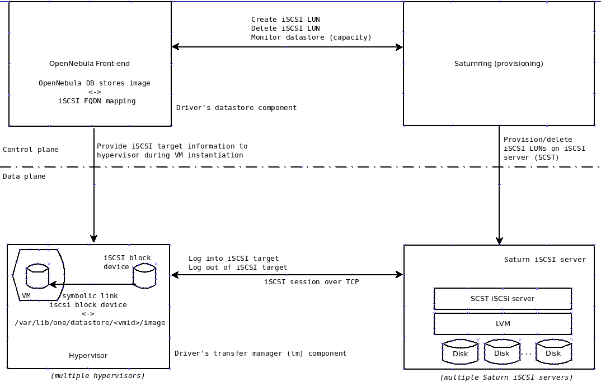

# Saturn OpenNebula Driver
---
## What is this?
The Saturn OpenNebula driver enables OpenNebula to use Saturn as the storage backend for a persistent block device datastore.

Read more about [Saturn](https://github.com/sachinkagarwal/saturnring/blob/master/doc/Saturn%20Cloud%20Storage%20Developer%20and%20User%20Guide.pdf), scale out iSCSI block storage
<br>
Read more about [OpenNebula](http://opennebula.org/), private and hybrid enterprise cloud computing

A good use case would be SSD-class storage, exported via iSCSI over a high-performance network, and made available to OpenNebula VMs as a persistent image to support high IOPs, low latency workloads.

##Compatibility and Limitations

* Tested on OpenNebula 4.12.

* System datastore is currently not supported.

## Design
The Saturn OpenNebula driver is based on the [datastore drivers structure](http://docs.opennebula.org/4.12/integration/infrastructure_integration/sd.html) of OpenNebula. It also borrows ideas and code from the [OpenNebula addon-iscsi driver] (https://github.com/OpenNebula/addon-iscsi), which allows OpenNebula to create an iSCSI datastore from a single [tgt iscsi server](http://stgt.sourceforge.net/). Users wanting to understand the discussion may want to keep these two references handy.

The driver has two components. The datastore component is used to provision and delete Saturn-based images while the transfer manager (tm) is used to attach or detach images (created by the datastore component) to VMs (including VM migration support). Look at the illustration (saturn-opennebula-architecture.png).



The above figure shows how the architecture of the driver, OpenNebula and Saturn work. The top half of the figure shows the control plane where the OpenNebula Front-end and the saturnring provisioning server interact. The Saturn OpenNebula driver's datastore component uses the Saturnring API to provision and delete iSCSI target LUNs on Saturn iSCSI server(s) when the corresponding OpenNebula images are created or deleted using the `oneimage` command or via the Sunstone API. These iSCSI targets are mapped to OpenNebula images that can be used by VMs as persistent block devices.

The transfer manager component of the the Saturn OpenNebula driver handles the process of attaching the Saturn image in the VM template by logging into the corresponding iSCSI target. The iSCSI session is established from the hypervisor to the Saturn iSCSI server. The transfer manager makes a symbolic link between the iSCSI block device on the hypervisor and the  libvirt block device that is made available to the VM. The transfer manager is also responsible for tearing down the iSCSI connection between the hypervisor and the saturn iSCSI server when the VM is removed from the hypervisor. VM Migration is also supported.

A subtle but important resilience feature of the driver is that the transfer manager never interacts with the Saturnring provisioning server. All the information needed to log into the iSCSI target is stored in the OpenNebula DB when the saturn image is provisioned (created). The iSCSI FQDN and the IP address of the Saturn iSCSI server are extracted directly from the OpenNebula database at VM provisoning/migration time. Therefore all pre-existing images can be used without the dependency on the saturnring provisoning server.

## Installation

Steps to install the Saturn OpenNebula driver are described below.

### OpenNebula Front-end
The machine that holds the OpenNebula installation is called the Front-end. This installation procedure assumes that the oneadmin user's home
directory at `/var/lib/one` on the front-end. The steps to complete on the front-end are listed below:


1. Copy the following directories from the driver code into the Front-end
```bash
datastore/saturniscsi => /var/lib/one/remotes/datastore/saturniscsi
tm/saturniscsi => /var/lib/one/remotes/tm/saturniscsi
```

2. Configure the DS_MAD and TM_MAD sections of `/etc/one/oned.conf` on the Front-end.
Replace
```bash
TM_MAD = [
    executable = "one_tm",
    arguments = "-t 15 -d dummy,lvm,shared,fs_lvm,qcow2,ssh,vmfs,ceph"
]
```
with
```bash
TM_MAD = [
    executable = "one_tm",
    arguments = "-t 15 -d dummy,lvm,shared,fs_lvm,qcow2,ssh,vmfs,ceph,saturniscsi"
]
```
Replace
```bash
DATASTORE_MAD = [
    executable = "one_datastore",
    arguments  = "-t 15 -d dummy,fs,vmfs,lvm,ceph"
]
```
With:
```bash
DATASTORE_MAD = [
    executable = "one_datastore",
    arguments  = "-t 15 -d dummy,fs,vmfs,lvm,ceph,saturniscsi"
]
```
3. Add a new TM_MAD_CONF section to `/etc/one/oned.conf`
```bash
TM_MAD_CONF = [
    name        = "saturniscsi",
    ln_target   = "NONE",
    clone_target= "NONE",
    shared      = "yes"
]
```
Restart the `one` service as oneadmin user.
```bash
sudo su - oneadmin
one restart
```
4. Obtain credentials for the Saturn storage account from the saturn admin. All the saturn storage quota assigned to the account will become part of the saturn datastore. The datastore size can be changed at any time by changing this saturn quota value on the saturnring server. Populate the `saturniscsi.conf` configuration file in the datastore/saturniscsi directory with the credentials.
```bash
cat <<EOF > /var/lib/one/remotes/datastore/saturniscsi/saturniscsi.conf
SATURNRINGURL=saturnring.example.com
SATURNRINGUSER=<saturn user>
SATURNRINGPASSWORD=<saturn password>
EOF
```
5. Create the saturn datastore by creating the datastore OpenNebula template file
   and then running onedatastore create. Example:
```bash
cat <<EOF > saturniscsids.tpl
NAME = saturniscsi-datastore-cloudzone
DS_MAD = saturniscsi
TM_MAD = saturniscsi
DATASTORE_CAPACITY_CHECK = yes
EOF
onedatastore create saturniscsids.tpl
```
6. Confirm that the datastore has been created, and that the reported capacity of the datastore is equal to the quota assigned to the saturn user of Step 4 (use `onedatastore list`).

### OpenNebula  Hypervisors

Install the open-iscsi client software and set the iSCSI initiator name to a random string, prefixed by the string "iscsihypervisor". For
example (for Ubuntu)
```bash
sudo apt-get install open-iscsi
RANDOM=`date +%s`$$
cat <<EOF > /etc/iscsi/initiatorname.iscsi
InitiatorName=iqn.iscsihypervisor${RANDOM}${RANDOM}.ini
EOF
service open-iscsi restart
```
## Usage
A Saturn image has to be created for use in a VM. This is an example of a image template to make the image. "SIZE" is in MB.
```bash
cat <<EOF > saturnimage.tpl
NAME = saturnblockimage
TYPE = DATABLOCK
SIZE = 1000
AAGROUP = testgroup
DESCRIPTION = ThisIsATestImage
PERSISTENT = Yes
EOF
oneimage create saturnimage.tpl -d <saturn-datastore-id reported by
onedatastore list>
```

The image template is not unlike other OpenNebula image templates. The only unique parameter (which is optional) is the "AAGroup" - the anti-affinity group setting. The saturnring provisioner will make a best-effort to separate images with the identical AAGroup parameter into different physical iSCSI servers if capacity permits. This parameter is useful for example, while creating 2 images that are attached to a VM and a software RAID-1 setup is attempted. Note the best-effort nature of the algorithm. It will provision storage even if the anti-affinity condition is violated if sufficient capacity is not available. This is clearly documented in the Saturn documentation.

Verify that an iSCSI LUN corresponding to the image was created on the Saturnring portal. The datastore-ID and the image-id will be appended to the iscsi targetname and the iqnini fields.

Likewise, Saturn images can be deleted via the `oneimage delete <image_id>` command or via Sunstone. The target should also disappear from the Saturnring portal.

Other notable features include

1. Support for __hotplugging__ images (if the VM's OS supports it).
```bash
oneadmin@onefrontend:~$ onevm list m
    ID USER     GROUP    NAME            STAT UCPU    UMEM HOST TIME
     1 oneadmin oneadmin ubuntuvm        runn    0    284M 192.168.50 0d 00h01
oneadmin@onefrontend:~$ onevm disk-attach 1 --image 2
oneadmin@onefrontend:~$ oneimage list
  ID USER       GROUP      NAME            DATASTORE     SIZE TYPE PER STAT RVMS
   1 oneadmin   oneadmin   Centos 7        default        10G OS    No rdy     0
   2 oneadmin   oneadmin   saturnblockimag saturniscs   1000M DB   Yes used    1
   3 oneadmin   oneadmin   Ubuntu 1404, 64 default        10G OS    No used    1
oneadmin@onefrontend:~$
```

2. Support for __migration__ (live migration not tested (ymmv), only halt and resume migration tested)
 ```bash
oneadmin@onefrontend:~$ onevm migrate 2 192.168.50.18
oneadmin@onefrontend:~$ onevm list m
    ID USER     GROUP    NAME            STAT UCPU    UMEM HOST TIME
     2 oneadmin oneadmin ubuntuvm        migr    0      0K 192.168.50 0d 00h03
    ID USER     GROUP    NAME            STAT UCPU    UMEM HOST TIME
     2 oneadmin oneadmin ubuntuvm        boot    0      0K 192.168.50 0d 00h03
oneadmin@onefrontend:~$ onevm list m
    ID USER     GROUP    NAME            STAT UCPU    UMEM HOST TIME
     2 oneadmin oneadmin ubuntuvm        runn    0      0K 192.168.50 0d 00h03

oneadmin@onefrontend:~$ onevm list m
```


## Debugging
The Saturn OpenNebula driver logs to the `/var/log/one/oned.log`. Special emphasis has been placed on reporting meaningful logs so that the oneadmin and the storageadmin can quickly determine  the root-cause of a provisioning, deletion, monitoring, or saturn image linking failures.

In addition, Saturnring provides exhaustive logging of creation, usage, and deletion of iSCSI targets. The log can be accessed via a browser on port 9021 of the saturnring server and via the commandline on the saturnring server (default location at /nfsmount/saturnring/saturnringlog/saturn.log).

TBD - table of error cases and synptoms/logs/troubleshooting
|Sl.no | Symptom | Cause | Troubleshooting |

_Note: if a Saturn image goes into `err` state (seen in the `oneimage list` command), run `oneimage enable <imageid>` to get it back into `Rdy` state_.

## Development

Developing the driver can be accomplished on the [sandbox OpenNebula VM](http://opennebula.org/tryout/sandboxvirtualbox/), but testing opportunities are limited because only 1 hypervisor is available (so VM migration testing is not possible). In addition, Virtualbox does not work with 64-bit nested VMs, limiting the developer to only 32-bit VMs.

For this reason, a multiple-hypervisor OpenNebula KVM-Vagrant setup is provided in the `on-devenv` directory. Note that it is not possible to run both virtualbox and KVM on the same hosts at present. So if the saturn storage is also setup as a Vagrant environment then it also needs to be on KVM hypervisors. Please refer to the README file in that directory for further information.


## Contributors

Sachin Agarwal <sachinkagarwal@gmail.com>

## License

Apache 2.0 license
http://www.apache.org/licenses/LICENSE-2.0

## Disclaimer

THE SOFTWARE IS PROVIDED "AS IS", WITHOUT WARRANTY OF ANY KIND, EXPRESS
OR IMPLIED, INCLUDING BUT NOT LIMITED TO THE WARRANTIES OF
MERCHANTABILITY, FITNESS FOR A PARTICULAR PURPOSE AND NONINFRINGEMENT.
IN NO EVENT SHALL THE AUTHORS OR COPYRIGHT HOLDERS BE LIABLE FOR ANY
CLAIM, DAMAGES OR OTHER LIABILITY, WHETHER IN AN ACTION OF CONTRACT,
TORT OR OTHERWISE, ARISING FROM, OUT OF OR IN CONNECTION WITH THE
SOFTWARE OR THE USE OR OTHER DEALINGS IN THE SOFTWARE.


